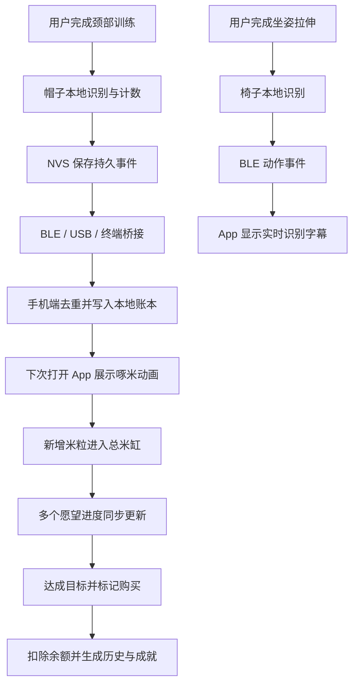
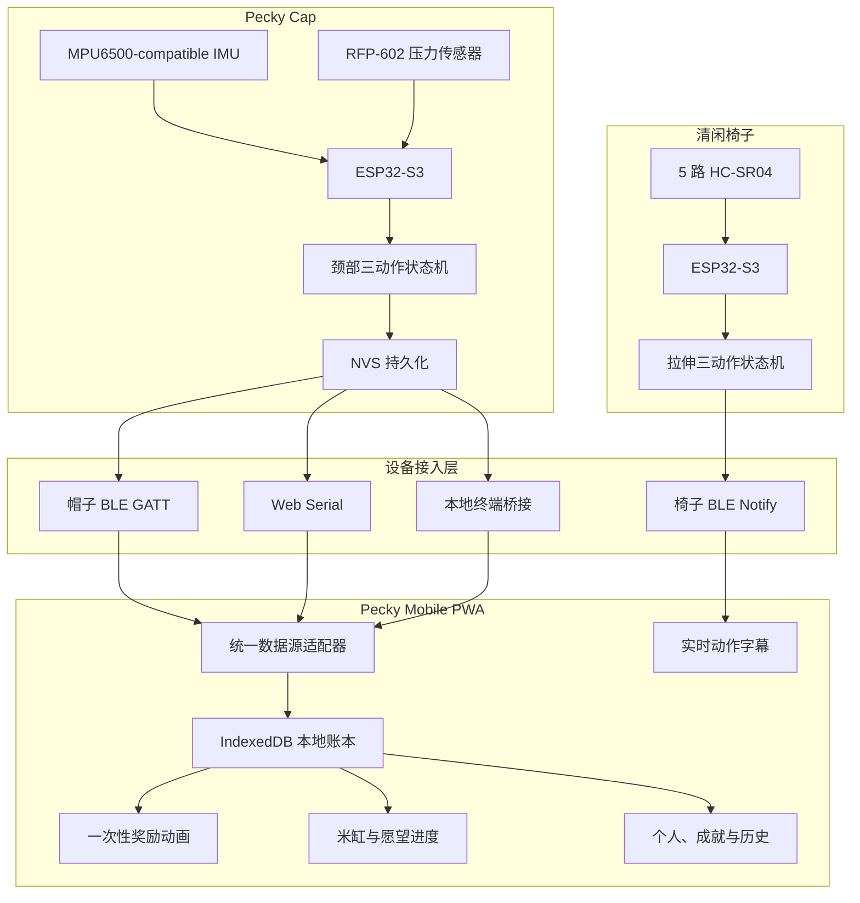

# Pecky「啄米」项目提交文档

> 最终提交版 · 2026 年 8 月 30 日

## 一、作品基本信息

### 作品名称

**Pecky 啄米——智能行为激励与愿望储蓄系统**

### 作品 Slogan

**每一粒，都算数。**

### 作品描述

Pecky「啄米」是一套连接真实行为、即时反馈与长期愿望的多设备软硬件激励系统。Pecky Cap 以 ESP32-S3、六轴 IMU 和压力传感器识别颈部训练动作，在本地完成计数，并通过 BLE、USB 或终端桥接同步到 Pecky PWA；清闲椅子通过五路超声波传感器识别向左拉伸、向右拉伸和胸椎舒展，在界面中即时显示动作反馈。移动优先的 PWA 将帽子的每次有效动作转化为一粒“米”和一笔可视化愿望进度。用户再次打开应用时，小鸡会把尚未展示的米粒啄进米缸，随后页面自然收拢为米缸首页。一个米缸余额可同时映射奶茶、潮玩、演唱会门票等多个目标，并支持目标进度、购买扣款、历史记录和成就系统。Pecky 希望把重复、容易中断的健康训练，变成有情绪价值、可积累、可回顾的日常体验。

> Pecky 当前为行为激励与工程验证原型，不执行真实支付或资金托管，也不作为医疗器械或临床诊疗工具。

## 二、项目背景

长期伏案学习和工作的人群普遍知道需要活动颈肩、调整坐姿、保持训练，但这类动作通常重复、反馈弱、难以坚持。传统打卡工具要求用户主动打开应用并手动记录，行为本身与奖励之间存在明显断层：完成动作的那一刻没有即时反馈，长期目标又显得遥远。单一硬件也很难覆盖不同场景，因此项目同时探索“可穿戴训练”和“坐姿拉伸”两种入口，并用同一移动体验承接反馈。

Pecky 的核心洞察是：**人们缺少的往往不是目标，而是把每一次微小行动与目标建立联系的可见证据。** 因此，我们将训练动作设计成“啄米”，将累计结果设计成“米缸”，再把米缸余额投射到用户真正想要的奖励上。硬件负责可靠记录，软件负责情绪反馈和长期积累，用户无需在每次行动后立刻操作手机。

## 三、目标用户

### 核心用户

- 长期伏案的学生、设计师、程序员和内容创作者；
- 希望建立颈部训练、坐姿拉伸或日常活动习惯，但容易中断的人；
- 对普通打卡缺乏动力，更容易被视觉反馈、收藏和目标奖励激励的人；
- 重视隐私，希望第一阶段数据保存在个人设备上的用户。

### 典型使用场景

用户戴上 Pecky Cap 完成一组训练，设备在无手机连接时也能本地识别和计数；坐在清闲椅子上完成拉伸时，椅子会独立识别动作并在 App 中显示两秒“已识别”字幕。稍后打开手机，应用一次性展示帽子累计的新增米粒，小鸡完成啄米动画后，新增金额进入总米缸，多个愿望的完成比例同时更新。达到目标后，用户可以标记购买，系统从当前余额中扣除目标金额，并将结果沉淀为购买历史与成就。

## 四、项目目标

1. **降低记录成本**：通过帽子与椅子自动感知动作，减少手动打卡。
2. **建立即时反馈**：把新增行为以小鸡啄米动画集中呈现。
3. **连接长期愿望**：用同一米缸余额计算多个目标的完成比例。
4. **保证数据可靠**：支持事件去重、断线补账和原子化本地存储。
5. **形成可扩展接口**：模拟器、JSON、BLE、Web Serial 和终端桥接共用统一数据源契约。
6. **保持隐私与轻量**：V1 无账号、无云同步，核心数据保存在本机。

## 五、产品方案与核心流程

### 1. Pecky Cap 硬件端

- ESP32-S3 作为主控；
- MPU6500-compatible 六轴 IMU 采集姿态、角速度和运动特征；
- RFP-602 压力传感器采集后脑抗阻压力；
- 本地状态机识别后仰、收下巴和抱头抗阻三类动作；
- NVS 保存累计次数和事件序号，断线时仍可继续计数；
- 通过 BLE 发送动作完成事件、状态快照和同步信息；
- 当前工程样机同时提供 Web Serial 直连和本地终端桥接，作为稳定演示链路。

### 2. 清闲椅子硬件端

- 第二块 ESP32-S3 独立运行，不与帽子争用连接；
- 五路 HC-SR04 超声波测距覆盖左侧、中央和右侧运动区域；
- 上电校准中立距离，识别向左拉伸、向右拉伸和胸椎舒展；
- 识别在椅子端本地完成，BLE 只发送动作编号；
- App 显示符合视觉系统的“已识别 · 动作名”字幕，两秒后渐隐；
- 椅子动作当前用于即时姿态反馈，不改变米缸余额。

### 3. 开屏奖励与米缸首页

- 用户打开应用时，只领取尚未展示的新增事件；
- 小鸡啄米动画展示本次新增米粒和金额；
- 事件在动画开始前即被标记，刷新或异常退出不会重复播放同一批奖励；
- 奖励页以缩放、收拢方式自然过渡为米缸首页；
- 过渡结束后进入静态信息页面，小鸡围绕米缸运动，余额文字保持清晰可读；
- 开屏奖励为单向流程，用户不能手动反复触发。

### 4. 愿望目标系统

- 用户可创建不同金额与类型的愿望，如奶茶、玩偶、门票、旅行等；
- 所有愿望共享同一个米缸余额，但分别计算完成比例；
- 愿望按目标金额排序，清晰展示还差多少和当前百分比；
- 余额充足后才可标记购买；
- 确认购买后扣除对应金额、移除当前愿望并写入购买历史；
- 历史累计金额和累计啄米次数不会因购买而减少。

### 5. “我的”页面

- 昵称、账号标识和个人签名；
- 累计攒米金额、累计啄米次数和陪伴天数；
- “第一粒米”“百次啄米”“清闲椅子”等成就；
- 已完成愿望与购买历史；
- 声音设置、本地数据管理、模拟数据与 JSON 导入；
- 帽子 BLE、USB 直连、终端桥接与清闲椅子 BLE 的独立连接和状态展示。

## 六、系统架构

系统将职责明确拆分：硬件决定“动作是否有效”，App 决定“动作如何转化为奖励或实时反馈”。帽子事件进入本地账本并影响米缸，椅子事件只触发动作字幕，不改变余额。设备侧只传输语义事件和快照，不持续发送高频原始数据，从而降低功耗与连接压力。模拟器、JSON、BLE、Web Serial 和终端桥接均实现统一的数据源契约，便于在没有实机或某条无线链路不稳定时继续开发和演示。

## 七、技术栈

| 层级 | 技术与工具 | 作用 |
| --- | --- | --- |
| 移动 Web | React 19、Next.js 16、TypeScript 5.9 | 页面、交互、状态与业务逻辑 |
| 构建与运行 | Vinext、Vite 8、Cloudflare Workers / Sites | PWA 构建、边缘运行与部署 |
| PWA 能力 | Web App Manifest、Service Worker | 安装到桌面、离线外壳与资源缓存 |
| 本地数据 | IndexedDB | 余额、事件、愿望、购买和设置持久化 |
| 硬件连接 | Web Bluetooth、Web Serial、WebSocket 终端桥接、统一 GATT 协议 | 帽子与椅子的多链路接入、事件与命令通信 |
| 硬件主控 | ESP32-S3-N16R8 | 传感器采样、动作识别、持久化与 BLE |
| 传感器 | MPU6500-compatible IMU、RFP-602、五路 HC-SR04 | 颈部姿态、抗阻压力和坐姿拉伸距离采集 |
| 固件 | Arduino ESP32 Core、C++、NimBLE-Arduino | 本地状态机、NVS 与 BLE 服务 |
| 本地桥接 | Python、PySerial、WebSocket | 将帽子 COM7 事件稳定转发给 Web App，并统一开始/暂停控制 |
| 数据分析 | Python、NumPy、Pandas、SciPy、scikit-learn | 特征分析、参与者隔离验证与阈值探索 |
| 质量保障 | ESLint、Node Test Runner、C++ 合成测试与 CSV 回放 | 前端、数据规则和识别状态机验证 |

## 八、核心创新点

### 1. 从“行为计数”到“愿望进度”的情绪化映射

Pecky 不只显示完成次数，而是将动作转化为米粒、余额和愿望进度。用户看到的不是抽象数据，而是“离想要的东西又近了一点”，让日常训练具有具体的情绪回报。

### 2. 一个米缸同时映射多个愿望

传统储蓄工具往往要求为每个目标单独分配金额。Pecky 使用一个共享余额，让用户同时看到奶茶、潮玩和演唱会门票等不同愿望的可达程度，在不切割资金的情况下提供多尺度激励。

### 3. 面向延迟打开场景的一次性奖励动画

用户完成动作时不需要立刻打开手机。系统保存尚未展示的事件，在下次启动时集中播放啄米动画，并在动画开始前完成领取标记。这种设计兼顾惊喜感与幂等性，避免刷新造成奖励重复。

### 4. 边缘识别、断线计数与最终对账

动作判断和计数发生在 ESP32 本地，手机断开时设备仍然工作。BLE 事件使用持久序号，App 通过 `deviceId + sequence` 去重，并在重连后使用累计快照补回遗漏，形成适合低功耗硬件的可靠同步链路。

### 5. 多设备、硬件无关的数据接入层

Mock、JSON、帽子 BLE、Web Serial、终端桥接和椅子 BLE 使用统一的数据源契约。帽子事件进入米缸账本，椅子事件进入即时反馈层，同一个 App 可以承接不同硬件语义，后续接入新设备时无需重写愿望、成就和动效逻辑。

### 6. Local-first 隐私设计

V1 不要求账号，个人目标、购买记录和行为数据保存在设备端。该方案降低了原型阶段的隐私风险，也让产品在弱网或无网情况下保持可用。

## 九、团队分工

| 方向 | 负责人 | 主要工作 |
| --- | --- | --- |
| 产品与体验设计 | `isabelli728` | 产品框架、Jar / Me 页面、愿望与成就体系、视觉系统、动效逻辑、移动端适配与体验验收 |
| PWA 前端与部署 | `isabelli728` | React / TypeScript 实现、本地账本、一次性开屏流程、PWA 资源、动画性能优化、测试与线上部署 |
| 硬件与嵌入式 | `iboy425` | 帽子与清闲椅子的 ESP32-S3 链路、传感器采集、固件状态机、NVS、BLE 与串口控制 |
| 数据与识别验证 | `iboy425` | 帽子与椅子的数据采集工具、动作特征分析、参与者隔离验证、C++ 回放、终端桥接和实机诊断 |
| 软硬件联调与交付 | 全员 | 协议冻结、数据接口联调、演示流程、问题复盘、GitHub 交接和最终版本冻结 |

> 对外提交前可将 GitHub 用户名替换为团队成员真实姓名；分工内容已经依据最终仓库中的实际提交整理。

## 十、开发过程

### 阶段 1：产品定义与范围冻结

团队首先确定“真实动作 → 啄米 → 米缸 → 愿望”的核心闭环，并将 Jar 与奖励动画合并为同一页面，将 Me 作为独立页面。V1 明确采用单设备、本地数据和手机 PWA，预留硬件接口，避免在账号、支付和云同步上分散开发资源。

### 阶段 2：硬件基线与数据采集

完成两块 ESP32-S3 的基础链路：帽子侧验证 IMU 与压力传感器，椅子侧验证五路超声波、MPU 与蜂鸣器；建立串口采集、Flash 日志和参与者数据下载工具。数据按参与者隔离，原始 CSV 不提交到公共仓库。

### 阶段 3：动作识别与 BLE 协议

将帽子的后仰、收下巴和抱头抗阻拆分为独立状态机，共享校准和特征层，通过总仲裁器避免重复计数；椅子端以五路距离基线识别左拉伸、右拉伸和胸椎舒展。随后冻结两套 GATT Service、事件字段、快照和控制命令，使固件和 App 可以并行开发。

### 阶段 4：PWA 核心功能实现

完成本地余额、愿望、购买、成就、个人资料和事件账本；实现 Mock、JSON、帽子 BLE、Web Serial、终端桥接和椅子 BLE 数据源；加入金额整数化、事件去重、跨标签页刷新和 IndexedDB 原子事务。

### 阶段 5：动效与视觉打磨

依据 Pecky 视觉系统整合小鸡、米缸、奖励和成就素材，反复调整手机屏幕比例、背景色、视频裁切和奖励页收拢转场。动画默认静音，避免循环闪烁，并保持页面在单屏内完成主要浏览。

### 阶段 6：联调、测试与版本冻结

通过前端构建测试、业务规则测试、C++ 状态机合成测试和历史数据回放检查关键路径；修复奖励重复播放、余额扣除、视频闪帧和 PWA 资源缓存问题；增加终端统一开始/暂停、帽子 USB 事件桥接和椅子断线后持续广播，最终将代码、文档、素材生成脚本和硬件协议统一提交到 GitHub。

## 十一、当前完成度与验证状态

### 已完成

- 手机优先的 Jar / Me 双页面 PWA；
- 一次性开屏奖励动画与米缸首页收拢转场；
- 多愿望共享余额、进度计算、购买扣款与历史归档；
- 个人资料、累计数据、成就和本地数据设置；
- IndexedDB 持久化、事件去重和断线补账规则；
- Mock、JSON、帽子 BLE、Web Serial、终端桥接和椅子 BLE 数据源适配器；
- 帽子 ESP32 三动作识别框架、NVS 计数和完整 BLE GATT 协议；
- 清闲椅子五路超声本地识别、独立 BLE 服务和三类动作字幕；
- 帽子 USB 串口事件流、本地 WebSocket 桥接和连接自动开始/断开自动暂停；
- 面向 Android / 桌面 Chromium 的 Web Bluetooth 与面向桌面 Chromium 的 Web Serial 代码链路；
- 两台设备的统一终端开始、暂停、状态和校准命令；
- 自动化构建、前端测试、固件合成测试和 CSV 回放工具。

### 已验证但仍需扩大样本

- 抱头抗阻识别在两份专项回放中完成 6 次人工确认动作并输出 6 次事件；该结果用于证明状态机功能，不等同于陌生用户泛化准确率；
- 后仰与收下巴已有可运行识别器，但现有数据的中立段与动作边界不足，尚未达到可对外宣称的事件级准确率门槛；
- 清闲椅子的三动作识别已由真实距离传感器驱动，不使用定时器或串口伪造事件；当前阈值仍需通过多参与者数据和盲测验证；
- 当前实机帽子 BLE 启动仍需解决供电掉压问题，协议和 App 解析链路已完成；现场演示优先使用已经接入 App 的 USB / 终端桥接路径，修复供电后再验收帽子无线链路。

### 平台边界

- Web Bluetooth 可在 Android Chrome 与桌面 Chromium 使用；
- Web Serial 仅适用于支持该能力的桌面 Chromium；终端桥接需要在演示电脑运行本地辅助服务；
- iOS Safari 暂不支持 Web Bluetooth，未来需使用原生或跨端 BLE 容器接入相同 GATT 协议；
- V1 使用单端本地账本，可连接多种硬件输入，但不包含账号、跨手机云同步和真实资金交易。

## 十二、后续计划

### 短期：完成工程样机闭环

- 修复并验证 ESP32 射频启动时的供电稳定性；
- 完成帽子终端桥接与椅子 BLE 同时接入手机界面的无剪辑端到端演示；
- 使用逐次事件标签采集 3–5 名未参与调参用户的封存测试集；
- 分别验证帽子三动作和椅子三动作的事件级准确率；
- 优化传感器固定、重新佩戴/就坐校准和 BLE 自动重连体验；
- 为 iPhone 增加原生或跨端 BLE 桥接层。

### 中期：提升产品可用性

- 支持用户自定义“动作次数—奖励金额”规则；
- 增加训练计划、趋势图和更丰富的成就体系；
- 在用户明确授权下提供可选账号与加密云同步；
- 将椅子动作纳入可配置奖励规则，并支持更多日常行为输入；
- 完善无障碍、低端手机性能与离线资源管理。

### 长期：走向小型化与规模验证

- 将开发板原型迭代为更轻、更舒适的定制 PCB 与结构件；
- 增加 OTA、功耗管理和更稳定的传感器组合；
- 在不做医疗效果夸大宣传的前提下开展长期行为坚持度研究；
- 将 Pecky 从帽子与椅子原型扩展为可连接更多健康行为硬件的激励平台。

## 十三、项目价值

Pecky 的价值不只是“把动作换成钱”，而是用一个温暖、容易理解的角色和视觉隐喻，让用户看见微小行动的累积。它同时验证了四类能力：用不同形态的边缘设备记录真实行为、以多种连接方式完成可靠接入、在断线环境下保存与补账，以及用愿望与收藏成就构建持续激励。帽子和椅子的共同接入证明 Pecky 不只是单一硬件 App，而是一套可扩展的行为激励体验框架。

## 十四、建议演示流程（约 90 秒）

1. 展示 Pecky Cap、清闲椅子和移动 PWA 三个部分；
2. 连接帽子终端桥接和椅子 BLE，展示两台设备独立工作；
3. 完成一次帽子动作，说明识别发生在设备端，事件实时进入米缸账本；
4. 完成一次椅子拉伸，展示“已识别 · 动作名”字幕渐隐；
5. 重新打开应用，播放小鸡啄米和新增米粒动画；
6. 动画收拢进入米缸首页，展示多个愿望进度同时变化；
7. 标记一个已达成目标为已购买，展示余额扣除、历史和成就更新；
8. 打开 Me 页面，展示累计数据、本地隐私设计和多设备连接入口；
9. 用一句话收尾：**“Pecky 让每一次坚持，都成为靠近愿望的一粒米。”**

## 十五、项目链接

- 在线演示：<https://pecky-rice-jar.isabeldrlee.chatgpt.site/>
- GitHub 仓库：<https://github.com/iboy425/pecky>
