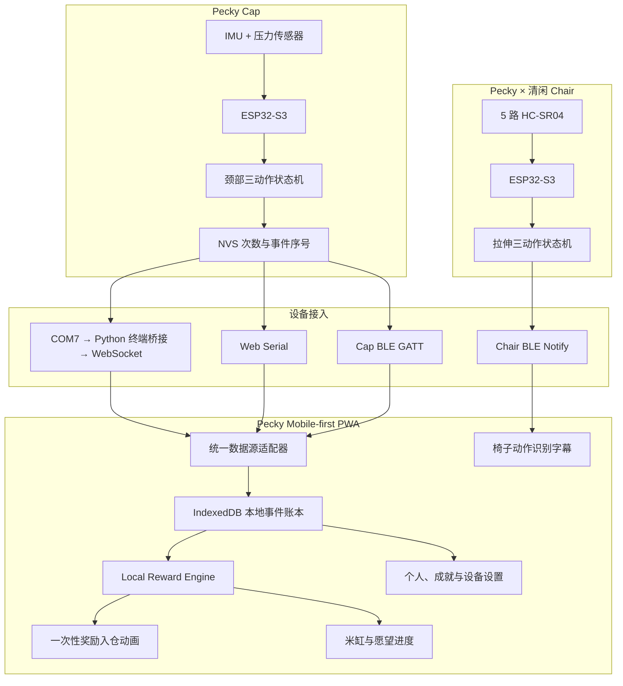

# 啄米 Pecky 项目提交文档

## 作品信息

| 项目 | 内容 |
| --- | --- |
| 作品名称 | **啄米 Pecky** |
| 作品 Slogan | **让延迟满足变成及时反馈** |
| 一句话描述 | 我们的智能帽子和椅子可以记录肩颈与腰背放松动作，并在 Pecky App 中兑换奶茶等小奖励，将用户对长期健康的投入可视化，形成短期激励闭环。 |

## 一、项目背景

Pecky 的出发点不是“再做一个健康打卡 App”，而是重新设计人为什么愿意长期坚持一个健康行为。我们观察到三个相互关联的问题：

### 问题 1｜健康反馈太慢

拉伸、康复训练、颈肩活动、久坐中断等行为，往往今天完成、几周甚至更久以后才感受到收益。问题并不是用户“不知道该做什么”，而是当下几乎没有反馈，因此很难持续。

### 问题 2｜想要的快乐太快

奶茶、包包、盲盒、演唱会票等“很想要、但总觉得需要一个理由才能买”的非必要消费，能提供即时快乐，却也容易带来消费负担。Pecky 将这类愿望变成健康行为的即时奖励。

### 问题 3｜真实人体数据难持续获得

医疗康复、人体工学与具身智能都需要长期、真实、多模态、带标签的人体运动数据。传统采集常依赖实验室、短期测试或人工任务，精准但成本高、周期短，也难反映真实生活中的自然动作。

## 二、目标用户

### 1. C 端首批用户

- 长期久坐、学习或办公时间长，希望改善身体状态但不愿增加额外健康管理负担的人群。
- 以年轻女性为首批核心用户，强调低打扰、低门槛、轻量、可持续的身体活动体验。
- 有明确“想买但舍不得”的小愿望，希望通过健康行为为消费建立更积极心理账户的人群。

### 2. B 端潜在合作方

- **人体工学设备公司**：需要更细粒度地理解用户坐姿、压力分布、微运动与疲劳变化。
- **医疗与康复机构**：需要在授权和合规前提下理解康复动作质量、频率和长期恢复轨迹。
- **具身智能与机器人公司**：需要理解人的运动状态、身体意图与真实环境中的行为变化。
- **视觉、可穿戴与 Human Activity Recognition 团队**：需要真实世界中持续产生的带标签人体动作数据。

## 三、作品描述

Pecky 是一套“动作自动验证 + 即时愿望奖励”的轻量健康系统。用户先设置自己想要的东西及每组动作对应的奖励金额；之后只需要完成真实的微运动，Pecky Cap、Pecky × 清闲 Chair 或其他传感节点自动识别有效动作，并将奖励实时计入“米缸”。

### 核心体验流程

**① 动一下 → ② 自动识别 → ③ 奖励入账 → ④ 愿望进度上涨 → ⑤ 继续重复**

关键点是：**动作本身就是交互。** 用户无需打开 App 点“开始”、无需手动计数、无需打卡。健康行为不再是一项额外任务，而是自然嵌入日常生活。

### 产品形态

- **Pecky Cap**：通过惯性与压力传感器识别头颈部轻量动作，例如后仰脖子、收下巴和抱头抗阻。
- **Pecky × 清闲 Chair**：当前原型通过椅背周围的五路距离传感器识别向左拉伸、向右拉伸和胸椎舒展；后续可进一步融合椅背、坐垫压力与身体接触信息。
- **Pecky App / PWA**：承载愿望设置、奖励规则、米缸余额、目标进度、动作记录、设备状态与“奖励入仓”动画。

## 四、技术栈与系统架构

本次原型采用“**边缘感知与动作判定 + 多通道事件接入 + Local-first 奖励闭环**”的架构。帽子和椅子分别在 ESP32-S3 上完成传感器读取与动作判断，只向应用发送已经识别的语义事件。PWA 负责事件去重、奖励计算、米缸与愿望展示；当前 MVP 不依赖云端后端，个人数据默认保存在本机浏览器中。

### 1. MVP 技术栈

| 模块 | 当前代码库实现 | 职责 |
| --- | --- | --- |
| Pecky Cap 动作感知 | ESP32-S3-N16R8、MPU6500-compatible 六轴 IMU、RFP-602 压力传感器 | 采集头颈姿态、角速度、运动脉冲和抗阻压力 |
| Cap 嵌入式识别 | Arduino ESP32 Core、C++ 三动作独立状态机、NVS | 本地识别后仰脖子、收下巴和抱头抗阻；持久化累计次数与事件序号 |
| 清闲 Chair 动作感知 | 独立 ESP32-S3、五路 HC-SR04 超声波距离传感器 | 校准中立距离并识别向左拉伸、向右拉伸和胸椎舒展 |
| Chair 嵌入式识别 | C++ 距离基线、持续帧判定、冷却与 NimBLE 服务 | 在椅端生成独立动作事件；当前只触发实时识别字幕，不改变米缸余额 |
| 帽子通信主路径 | USB 串口 COM7、Python / PySerial 终端桥接、本地 WebSocket | 当前演示推荐路径；App 连接时自动 START，断开时自动 PAUSE，并实时转发帽子动作事件 |
| 帽子通信备选 | Web Serial、Web Bluetooth、统一 GATT EVENT / SNAPSHOT / COMMAND 协议 | 支持桌面 Chromium USB 直连，并为修复供电后的帽子 BLE 与未来原生端保留接口 |
| 椅子通信 | Web Bluetooth、独立 GATT Service 与 Notify Characteristic | 椅子持续广播，App 可独立连接并接收三类动作事件 |
| 前端 | React 19、Next.js 16、TypeScript 5.9 | Jar / Me 页面、设备状态、愿望管理、奖励入仓动画与实时动作字幕 |
| PWA 构建与部署 | Vinext、Vite 8、Cloudflare Workers / Sites、Web App Manifest、Service Worker | Mobile-first 构建、安装能力、离线外壳、资源缓存与线上部署 |
| 奖励引擎 | `app/lib/model.ts` 中的本地业务规则 | 计算米缸余额、愿望进度、购买扣款、累计数据与成就解锁 |
| 本地数据层 | IndexedDB、串行读写事务、跨标签页状态刷新 | 保存动作事件、余额、愿望、购买记录、个人资料与设置 |
| 数据接入层 | Mock、JSON、帽子 BLE、Web Serial、终端桥接、椅子 BLE 适配器 | 统一不同来源的连接、拉取、订阅和连接状态 |
| 可靠性规则 | `eventId` 与 `deviceId + sequence` 去重、整数分单位金额、SNAPSHOT 对账 | 避免重复入账、浮点金额误差与断线期间事件丢失 |
| 测试与分析 | ESLint、Node Test Runner、C++ 合成测试、CSV 回放、Python / NumPy / Pandas / SciPy / scikit-learn | 验证 PWA、账本规则、状态机、动作特征与参与者隔离评估 |

### 2. 当前系统架构

### 3. 当前数据闭环

帽子完成动作后生成包含设备标识、持久序号、动作类型、次数和时间的结构化事件。PWA 对事件去重后写入 IndexedDB，由本地 Reward Engine 计算奖励。尚未展示的奖励会在用户下次打开应用时通过小鸡啄米动画集中“入仓”，随后更新所有愿望进度。椅子动作使用独立 BLE 服务进入实时字幕层，当前不参与余额计算，避免在奖励规则尚未确认前污染米缸账本。

当前 MVP 无云端 REST / Realtime 后端。未来可在不改变硬件语义事件格式的前提下增加授权、匿名化、加密上传和云端 Reward Engine。iOS Safari 目前不支持 Web Bluetooth；正式 iOS 版本可沿用现有 GATT 协议，通过 Core Bluetooth 或跨端原生插件接入。

### 4. 长期数据闭环

每一次奖励背后，对应一次真实发生、被设备自动验证的身体动作。随着用户长期使用，Pecky 可逐步形成 **Longitudinal × In-the-wild × Multimodal × Labeled** 的人体运动数据集，并在用户授权、匿名化与合规前提下，用于动作识别、个体化康复评估、人体工学优化及具身智能研究。

## 五、核心创新点

### 1. 用“可验证身体动作”替代传统打卡，建立低摩擦健康行为闭环

Pecky 不依赖用户手动签到、上传视频或自我记录，而是通过可穿戴设备与环境传感器自动识别真实完成的微运动。用户只需要完成动作，系统即可自动完成“识别—记录—奖励”，把健康行为从需要主动管理的任务，变成自然融入日常生活的交互。

### 2. 将长期健康收益转化为即时奖励，解决健康行为难以坚持的问题

运动、拉伸和康复训练的真实收益通常需要较长时间才能感受到，而 Pecky 将每一次被验证的动作即时转化为“米粒”和愿望进度，把“未来才会发生的健康收益”变成当下可见的正反馈，从而提高用户持续参与的动力。

### 3. 创造一种基于“真实参与”的新型品牌营销模式

传统互联网广告主要为曝光、点击和观看时长付费，而 Pecky 让用户通过真实完成一次 Peck 动作，证明自己是一个被验证的参与者。品牌方购买的不再只是“看过广告的人”，而是经过硬件验证、真实参与某项挑战的用户；品牌投入的部分营销预算又可以直接转化为用户完成 Peck 后获得的奖励权益。

由此形成一个新的增长飞轮：

**品牌投入奖励预算 → Peck 奖励更有吸引力 → 更多用户主动参与 → 产生更多可验证参与与社交内容 → 品牌获得更可信的参与效果 → 品牌愿意投入更多预算 → 奖励进一步增加 → 更多用户加入。**

因此 Pecky 不只是一个健康产品，也可以成为一种**“以真实身体行为为凭证”的新型互动营销媒介**。

### 4. 将消费产品变成长期人体行为数据入口

每一次 Peck 不只是一次奖励事件，也对应一段真实、带标签的身体运动数据。随着用户持续使用，Pecky 可以积累长期、多模态、真实场景下的人体运动数据，包括动作频率、幅度、速度、姿态变化及压力分布等。相比一次性的实验室采集，这类长期真实数据未来可用于动作识别、人体工学、康复辅助研究以及具身智能等场景。

## 六、团队分工

| 人员 | 主要职责 |
| --- | --- |
| 李丹戎 | 定义产品愿景、用户问题、奖励机制、数据飞轮与商业化路径；软件开发。 |
| 高天 | Pecky Cap、椅端 / Clip 传感器选型与结构设计；动作信号采集、ESP32 固件、阈值判定与通信；动作特征设计、时序数据清洗、动作识别与个体化阈值。 |
| 刘桐彤 | 移动端 PWA、米缸与愿望进度、奖励入仓动画、设备状态与用户体验闭环；Pecky 视觉系统、硬件外观、3D 打印原型、Pecky × 清闲联名表达及展位体验设计；共同定义产品愿景，设计海报、视频等展示内容。 |

## 七、开发过程

### 01｜需求洞察

从“用户知道健康行为有用，却难以长期坚持”的问题出发，确定即时反馈是产品核心，而不是增加更多健康教育。同时识别目前对于人体动作数据的巨大需求。

### 02｜机制设计

将“想要但舍不得”的非必要消费与健康行为绑定，形成“动作—验证—奖励—愿望进度”的最小闭环。

### 03｜动作与硬件原型

筛选适合久坐环境、动作轻、可重复、传感器可验证的微运动，并探索帽子 IMU、压力传感与椅端距离感知等硬件形态。

### 04｜软件交互设计

围绕低摩擦原则设计米缸、愿望目标、奖励入仓动画与多设备统一入口；避免手动打卡和复杂训练流程。

### 05｜数据架构设计

将原始传感器、动作事件、奖励事件与用户目标解耦，保证未来可以持续扩展更多动作、设备和模型。

### 06｜场景化验证

通过 Pecky Cap 与清闲人体工学场景展示完整闭环，并收集现场用户、人体工学与具身智能从业者反馈。

## 八、后续计划

| 阶段 | 产品目标 | 数据 / 商业目标 |
| --- | --- | --- |
| 阶段 1｜MVP | 跑通 Pecky Cap / 清闲 Chair → 动作识别 → 奖励入账 → 愿望进度的完整体验。 | 验证用户是否愿意因为即时奖励持续产生健康微动作。 |
| 阶段 2｜小规模内测 | 扩展更多动作、设备与奖励模板，优化识别准确率与佩戴 / 使用摩擦。 | 建立首批真实世界长期动作数据；形成匿名化数据标准和质量评估流程。 |
| 阶段 3｜个体化模型 | 根据个人历史动作建立个体基线，输出更适合不同身体状态的动作建议与人体工学反馈。 | 探索与医疗康复、人体工学企业的联合验证和模型合作。 |
| 阶段 4｜Human Body Intelligence | 融合 wearable、压力、视觉等多模态信息，理解身体状态与动作意图。 | 面向康复、智能人体工学、机器人 / 具身智能提供模型能力、数据基础设施与 API。 |

## 九、长期愿景

Pecky 的长期价值不止于消费端产品，而在于建立一个持续生长的真实世界人体运动数据基础设施。通过对长期、多模态、带标签的人体动作数据进行标准化、匿名化与模型化处理，未来向康复医疗、智能座椅、可穿戴设备、具身智能及计算机视觉企业提供数据服务、模型训练与人体行为理解能力。最终，我们希望成为机器理解“人如何坐、如何动、如何恢复、下一步可能做什么”的基础数据层。
