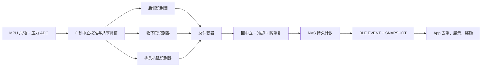

# 三动作独立识别与总流程

## 最终结构

帽子使用同一组 25 Hz 传感器数据，但三个动作不共用一个“看到一帧就分类”的计数器。共享层只负责校准与特征，三个识别器各自维护完整动作状态，最后由总仲裁器产生唯一结果。



核心代码位于 `firmware/04_hat_recognition_ble/recognition_engine.h`。它不依赖 Arduino，因此 ESP32 实时采样和电脑 CSV 回放使用同一套判断，避免 Python 与芯片逻辑不一致。

## 共享校准和排除条件

上电后保持正常坐姿、头部中立、不要按压力片 3 秒。固件获得陀螺仪零偏、重力方向、压力基线和压力噪声；校准期间明显移动会失败并重试。

共享层每 40 ms 生成：

- 相对中立的俯仰、滚转和总倾角；
- 去零偏角速度、绕重力轴的转头角速度；
- 去重力后的前后方向短时加速度；
- 平滑压力、相对压力；
- 是否已经稳定回到中立位置。

运行时不读取采集文件的 `phase`，也不根据“现在应该做到第几个动作”猜类别。

## 识别器 1：后仰脖子

完整状态是：`中立已武装 → 后仰方向运动 → 角度到位并保持 → 回到中立 → 完成一次`。

初始保守阈值：

- 后仰方向角速度连续约 80 ms 超过 `30°/s`；
- 相对俯仰达到 `12–45°`；
- 滚转小于 `12°`，转头角速度小于 `55°/s`；
- 到位保持约 0.48 秒；
- 必须完整回中立，才产生一个结果。

后仰正负方向由最终 IMU 固定朝向决定。当前帽子代码使用 `extensionSign=-1`；3D 外壳一旦固定后不得随意翻转模块。如固定方向相反，只改这一处并重新做回放，不用改 App。

## 识别器 2：收下巴

单个帽载 IMU 不能在静止时直接测量水平位移，因此代码识别“向后收的短脉冲 + 相反方向回正脉冲 + 全程头部角度基本不变”的完整波形。

初始保守阈值：

- 第一段前后加速度脉冲至少 `0.10g`；
- `0.24–1.6 s` 内出现相反方向、至少 `0.06g` 的回正脉冲；
- 全程总倾角和俯仰变化小于 `9°`，滚转小于 `8°`；
- 明显转头、连续震动、压力触发或大角度低头/抬头立即作废；
- 最后回到稳定中立才计数，计数后冷却 2 秒。

这一动作是三个动作中最依赖帽内 IMU 固定性的一个，宁可漏报也不能用任意“头动了一下”代替。

## 识别器 3：双手抱后脑抗阻

抗阻必须同时满足压力、稳定保持和时间，优先级最高：

1. App 先发送 `pressure_test`，用户完全松开约 0.5 秒，再把压力片压高约 0.5 秒；只有这次明确自检能设置 `pressureHealthy=true`，平时偶然高压不能冒充健康检查；
2. 正式动作必须从完整释放状态出现新的压力上升沿，进入阈值为 `P0 + max(600, 8×压力噪声)`；
3. 压力保持阶段使用更低的释放阈值形成滞回，并要求头部倾角小于 `10°`、角速度低于 `25°/s`；
4. 当前黑客松演示版持压 2 秒合格；正式 5 秒版本只需把 `50` 个采样改为 `125` 个；
5. 必须释放压力并回中立后才计一次，持续按住永远不会重复计数。

如果压力片没有可靠接触，`pressureHealthy=false`，固件禁止抗阻计数，同时压力通道不会抢占另外两个 IMU 识别器。现有数据只有 4/18 位参与者在抗阻阶段有可靠压力，因此机械固定和上电后的显式压力自检是 80% 目标成立的前提。

## 总仲裁与计数

优先级固定为：`抗阻 > 后仰 > 收下巴`。压力候选存在时，另外两个识别器立即复位；后仰和收下巴若同一时刻都声称完成，则本次冲突作废，不猜类别。

任一动作完成后进入 1.5–2 秒全局冷却，并要求下一次重新从中立开始。固件先把事件序号和累计次数写入 NVS，再发送 BLE；即使通知丢失，App 重连读取 SNAPSHOT 也能恢复最终真相。

## 回放测试

在 WSL 项目根目录执行：

```bash
g++ -std=c++17 -O2 -Wall -Wextra -Werror \
  -Ifirmware/04_hat_recognition_ble \
  tools/test_recognition_engine.cpp -o /tmp/pecky-test
/tmp/pecky-test

g++ -std=c++17 -O2 -Ifirmware/04_hat_recognition_ble \
  tools/replay_hat_recognizers.cpp -o /tmp/pecky-replay
/tmp/pecky-replay data/raw/hat_0027.csv
```

第一项合成测试验证三个状态机的完整顺序、压力自检门、释放、回中立和防重复。回放输出的 `phase_oracle` 只用于查看事件发生在哪个采集阶段，不会传入识别器。现有 CSV 可以验证粗粒度阶段一致性；由于没有每次动作的精确起止标记，不能据此声称已经完成真实事件级 60%/80% 验收。

截至 2026-08-29，18 份完整会话回放只在正确阶段命中 1 次后仰，收下巴与抗阻在对应阶段均未形成可靠事件，并出现过非目标阶段误触发。当前固件因此是**待逐次标注数据调参的实验骨架**，不能直接刷入比赛帽并宣称识别已完成。

## 目标验收

- 新参与者总体平衡准确率至少 50%；
- 后仰和收下巴事件级 F1 各至少 60%；
- 抗阻在压力自检通过的人群中，事件级精确率和召回率都至少 80%；
- 一次持续动作只产生一个事件；中立、校准和冷却阶段不能计数；
- 识别完成到 BLE EVENT 发出的延时不超过 150 ms。

达到这些数字必须用逐次标记的动作和困难负样本验收，不能用同一人的重叠窗口随机拆分刷分。
